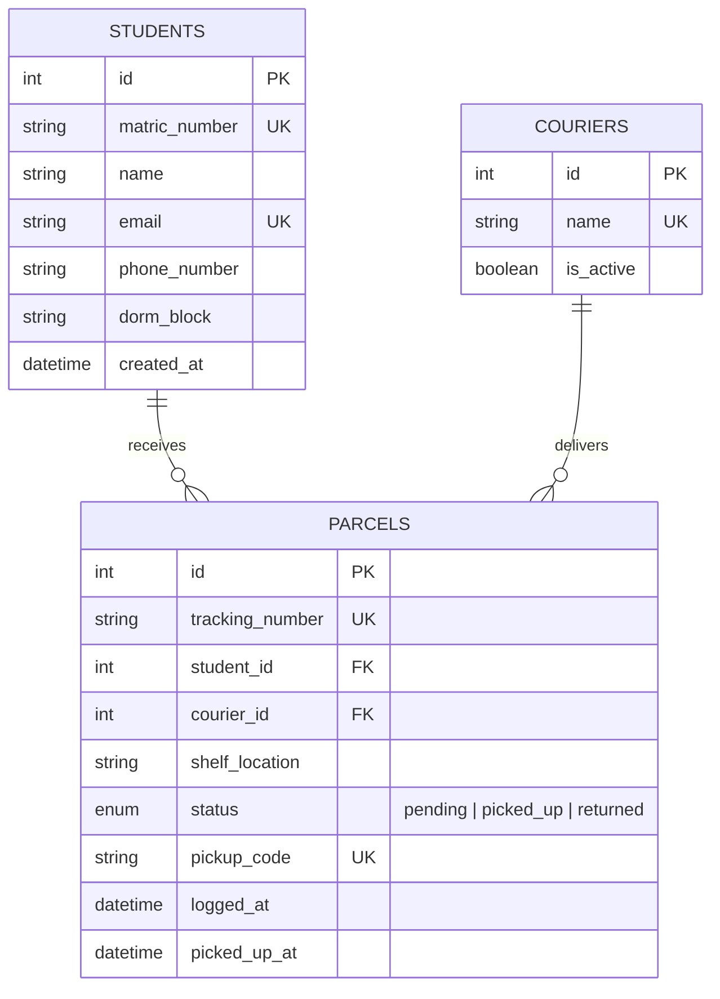

# 📦 Smart Parcel Induction System

An automated parcel logging, shelf allocation, and QR pickup verification system designed for university campus mailrooms.

---

## 🎯 Problem Statement
University mailrooms handle high volumes of e-commerce parcels daily. Traditional paper-based intake causes:
* **Storage Chaos**: Staff struggle to find where a package was placed.
* **Delayed Notifications**: Students wait hours or days without knowing their package has arrived.
* **Fulfillment Bottlenecks**: Long pickup queues at the counter while staff search manual logbooks.
* **Disputes & Lost Packages**: Inaccurate tracking logs and no verifiable proof of pickup.

This system digitizes the entire lifecycle: from courier scan at intake to student QR-code verification at the pickup counter.

---

## 🛠️ Tech Stack
* **Backend**: Python 3.13+, FastAPI, SQLAlchemy ORM, Pydantic v2
* **Database**: PostgreSQL (with SQLite compatibility for zero-setup local development)
* **Configuration**: `pydantic-settings` reading from `.env`
* **Frontend**: HTML5, Modern CSS, Vanilla JavaScript (Fetch API)

---

## 📂 Project Structure

```text
pickup-system/
├── app/
│   ├── __init__.py            # Core package initializer
│   ├── config.py              # Environment settings (Pydantic BaseSettings)
│   ├── database.py            # SQLAlchemy Engine, SessionLocal, get_db generator
│   ├── models/                # SQLAlchemy ORM database models
│   │   ├── __init__.py        # Exports all models & Base
│   │   ├── student.py         # Student table (matric, dorm, email)
│   │   ├── courier.py         # Courier table (DHL, FedEx, etc.)
│   │   └── parcel.py          # Parcel table (tracking, shelf, status, QR token)
│   └── main.py                # FastAPI instance, CORS middleware, health check
├── .env                       # Active environment variables (git-ignored)
├── .env.example               # Template environment configuration
├── .gitignore                 # Standard Python/Database gitignore
├── requirements.txt           # Project dependencies
├── seed_db.py                 # Table creation and sample data test script
├── main.py                    # Server launcher script
└── README.md                  # Project documentation
```

---

## 🚀 Getting Started

### 1. Set Up Virtual Environment
```bash
# Windows
python -m venv .venv
.\.venv\Scripts\activate

# macOS / Linux
python3 -m venv .venv
source .venv/bin/activate
```

### 2. Install Dependencies
```bash
pip install -r requirements.txt
```

### 3. Initialize & Seed Database
Run the seed script to create all database tables and load sample students and couriers:
```bash
python seed_db.py
```

### 4. Start the Development Server
```bash
python main.py
```
Or with Uvicorn CLI:
```bash
uvicorn app.main:app --reload --port 8000
```

### 5. Access Interactive API Docs
* **Swagger UI**: [http://127.0.0.1:8000/docs](http://127.0.0.1:8000/docs)
* **ReDoc**: [http://127.0.0.1:8000/redoc](http://127.0.0.1:8000/redoc)
* **Health Check**: [http://127.0.0.1:8000/api/v1/health](http://127.0.0.1:8000/api/v1/health)

---

## 🗄️ Database Design & Relational Rules



* **3NF Integrity**: Courier and Student details are normalized; parcels only hold foreign keys.
* **Foreign Key Constraints (`ondelete="RESTRICT"`)**: Prevents deleting a student or courier who has active parcels.
* **Indexes & Uniqueness**: `tracking_number`, `matric_number`, and `pickup_code` are indexed and marked unique to ensure fast lookups and prevent duplicates.
